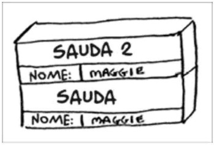

3.1 Suponha que eu forneça uma pilha de chamada como esta:

Quais informações você pode retirar baseando-se apenas nesta pilha de chamada?
É possível saber que a primeira função a ser chamada foi a "sauda", ela alocou uma variável "nome" com o valor de "Maggie". Em seguida, ela chamou "sauda 2" passando a variável "nome" como parâmetro.